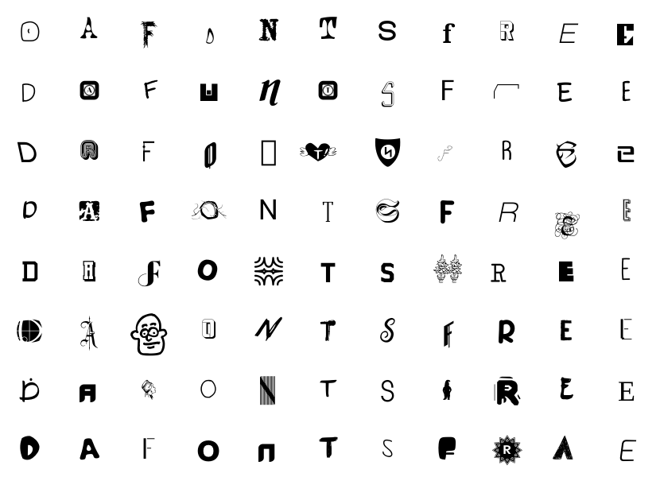

# DaFonts Free Dataset

This is the git repository associated the dafonts-free dataset. A dataset constructed of fonts labeled as `100% Free` and `Public domain / GPL / OFL` on https://www.dafont.com/ with `.ttf` and `.otf` extensions.



This repository includes the python code used to collect and organize the dataset. 

The dataset it's self is available as a zip file containing a `.csv` file with font metadata including filename, base_font_name, file_format, creator, category, and theme. 

Dataset is provided as-is (stated in the license) and if possible credit the creators the fonts in any project you use this dataset for.

## Dataset

```bash
sha1sum dafonts-free-v1.zip
6c7897c5a3b7f1e24143bf1db19373f2d2e16393  dafonts-free-v1.zip
```

```bash
sha256sum dafonts-free-v1.zip
fcbc92ef45e39eec18e694d2d4a0b1c8e8fc84b004e23ec9b3708663e9b63c0f  dafonts-free-v1.zip
```

### GitHub Release

link: []()

### Internet Archive

link: [https://archive.org/details/dafonts-free-v1](https://archive.org/details/dafonts-free-v1)

```
wget https://archive.org/download/dafonts-free-v1/dafonts-free-v1.zip
```

### gdown

link: [https://drive.google.com/file/d/1CVczE86Vg3KIlXFuPOGu3Y_zGZHJ-6VV](https://drive.google.com/file/d/1CVczE86Vg3KIlXFuPOGu3Y_zGZHJ-6VV)

```bash
gdown --id 1CVczE86Vg3KIlXFuPOGu3Y_zGZHJ-6VV
```

### Kaggle

link: [https://www.kaggle.com/duskvirkus/dafonts-free](https://www.kaggle.com/duskvirkus/dafonts-free)

## Running Scripts

### Setup

Install chrome/chromium

Get driver from https://sites.google.com/chromium.org/driver/

```bash
conda create -n dafont-scraper python=3.8
conda activate dafont-scraper
pip install -r requirements.txt
```

### Usage

```bash
python create_font_list.py --help
```

```bash
python download.py --help
```

```bash
python dist.py --help
```

## Citation

```bibtex
@misc{dafonts-free,
  title         = {Dafonts Free Dataset},
  year          = {6 March 2022},
  url           = {https://github.com/duskvirkus/dafonts-free}
  author        = {D. Virkus},
}
```
